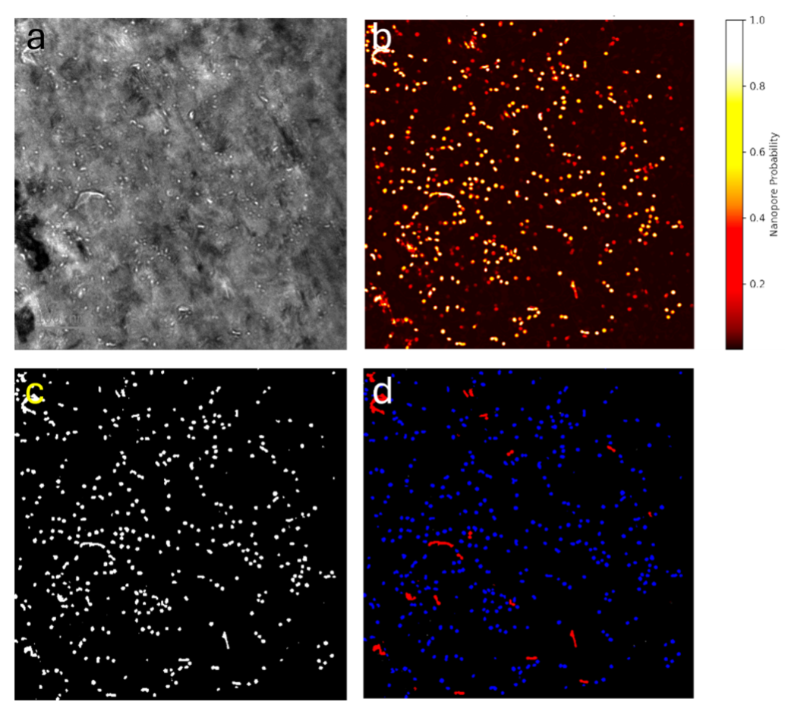

PoroDet: Deep learning based detection and quantification of features in TEM images

Rajat Namaa, Deepak Kumarb, Tahmid Choudharya, Chris Grovenora, Sergio Lozano-Pereza  
a Department of Materials, University of Oxford, Parks Road, Oxford OX1 3PH, UK  
b Indian Institute of Technology Madras, Guindy, Chennai, Tamil Nadu 600036, India

## Summary
PoroDet is an open-source Python workflow for supervised feature extraction from transmission electron microscopy (TEM) images. The software provides a task-specific end-to-end pipeline, integrating dataset preparation, model training, batch inference and quantitative post processing within a fully scriptable and reproducible framework. Whilst originally developed for nanopores and nanocracks in Fresnel contrast TEM images, the workflow is designed to be adaptable to other TEM feature classes through training with user supplied image mask annotations.
TEM images commonly exhibit abstract, acquisition-dependent contrast, strong variability between datasets, and limited availability of annotated training data. PoroDet addresses these constraints by training a standard encoder–decoder convolutional neural network based on the U-Net architecture [1]. The workflow supports the training either from scratch or via fine-tuning (transfer learning), while treating training and data augmentation as standard components of the workflow rather than specialized steps.

## Statement of Need
Quantitative extraction of nanoscale features from TEM images is essential across many areas of materials science but remains challenging due to weak and highly variable contrast, imaging artefacts, and acquisition-dependent appearance variations [2]. Manual segmentation is subjective and difficult to reproduce, while simple feature-based or contrast-thresholding approaches often fail in the presence of complex image backgrounds and contrast reversals from diffraction contrast.
Classical machine learning approaches based on hand engineered descriptors, such as Random Forest classifiers [3], were evaluated as an initial baseline. but were found to be ineffective for weak contrast and highly variable TEM images, where feature boundaries are poorly captured by fixed descriptors.
Transfer learning using pretrained models developed for natural or medical imaging also often offers limited benefit for TEM data, as relevant features are defined primarily by imaging physics and acquisition conditions rather than semantic object identity [4]. In addition, annotated datasets are typically small due to the cost and expertise required for generating reliable pixel-level masks [2,4]. There is therefore a need for a reproducible pipeline that makes supervised learning practical under these constraints.
PoroDet addresses this need by providing a feature-agnostic and scriptable workflow tailored to TEM images, in which supervised training enables reproducible feature extraction across datasets and users. By combining explicit data augmentation, training from scratch and automated batch analysis, the pipeline enables direct extraction of quantitative descriptors from small and heterogeneous TEM datasets.

## Software Description
PoroDet is implemented in Python using PyTorch [5] together with standard scientific libraries including NumPy [6], SciPy [7], OpenCV [8], Matplotlib [9], Scikit-learn [10], Pandas [11], and Albumentations [12]. The core of the pipeline is a standard encoder–decoder convolutional neural network based on the U-Net architecture with skip connections [1], configured to process the high-resolution paired image–mask annotations (e.g., 4096 × 4096 pixels) by automatically resizing to architecture resolution (e.g. 1024 × 1024 pixels) for efficient training.
To address limited dataset sizes, PoroDet incorporates explicit data augmentation during training [12] and is designed to be iteratively fine-tuned as imaging conditions or feature definitions evolve. Augmentations such as rotation, intensity scaling, contrast inversion, and noise addition preserve feature identity in TEM images because nanoscale features are invariant to orientation and absolute intensity, while these transformations reflect natural variability in other microstructural or contrast features between acquisitions.
After training, the pipeline performs batch inference and applies lightweight post processing to extract two-dimensional quantitative descriptors, including area fractions, size distributions, and shape metrics. Three-dimensional reconstruction and connectivity analysis are intentionally outside the scope of the current release.

## Example

Figure shows representative results from a Fresnel-contrast TEM image analysed with PoroDet. The sample was prepared by FIB milling and is approximately 50 nm thick. The model was trained on annotated nanoporosities in Zr-oxide layers formed during corrosion of a commercial nuclear Zr alloy (X2®), acquired at 300 kV, 100 kX magnification, and −10 μm defocus. Panel (a) shows the raw image, (b) the pore probability map, (c) the binarized segmentation mask, and (d) an overlay of detected features. In this example, nanopores and nanocracks were treated as a single feature class during training and were distinguished during post-processing using shape-based descriptors such as aspect ratio. Quantitative extracted metrics are shown in the table below.
| Metric              | Value     |
|---------------------|-----------|
| Total nanopores     | 151       |
| Average pore area   | 1942 px²  |
| Porosity            | 5.63 %    |

## Acknowledgements
The authors gratefully acknowledges the Department of Materials and the David Cockayne Centre for Electron Microscopy (DCCEM), University of Oxford, for providing access to TEM facilities and technical support. The author also thanks Westinghouse Electric for supplying the Zr alloys and the University of Manchester for performing the corrosion of these alloys.

## References
[1] Ronneberger O, Fischer P, Brox T (2015). U-Net: Convolutional networks for biomedical image segmentation. MICCAI, LNCS 9351, 234–241.
[2] Botifoll M, Madireddy S, Li Z, Panagiotopoulos A, Haigh SJ, Prestat E, Susi T (2022). Machine learning in electron microscopy for advanced nanocharacterization. Nanoscale Horizons, 7, 1086–1108.
[3] Breiman L (2001). Random forests. Machine Learning, 45, 5–32.
[4] Horwath JP, Zakharov DN, Mégret R, Stach EA (2020). Understanding important features of deep learning models for segmentation of high resolution transmission electron microscopy images. npj Computational Materials, 6, 108.
[5] Paszke A et al. (2019). PyTorch: An imperative style high performance deep learning library. NeurIPS, 32.
[6] Harris CR et al. (2020). Array programming with NumPy. Nature, 585, 357–362.
[7] Virtanen P et al. (2020). SciPy 1.0: Fundamental algorithms for scientific computing in Python. Nature Methods, 17, 261–272.
[8] Bradski G (2000). The OpenCV Library. Dr. Dobb’s Journal of Software Tools.
[9] Hunter JD (2007). Matplotlib: A 2D graphics environment. Computing in Science & Engineering, 9(3), 90–95.
[10] Pedregosa F et al. (2011). Scikit-learn: Machine learning in Python. Journal of Machine Learning Research, 12, 2825–2830.
[11] McKinney W (2010). Data structures for statistical computing in Python. Proceedings of the 9th Python in Science Conference, 51–56.
[12] Buslaev A et al. (2020). Albumentations: Fast and flexible image augmentations. Information, 11(2), 125.

